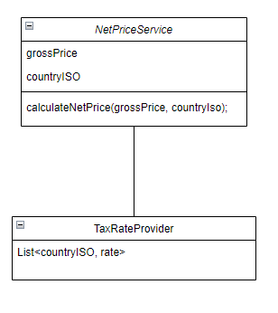

# Net price calculator service

## Overview
Application for calculating net price of a product based on the price and tax rate.

## Requirements
1. As a consumer, I need to calculate net price from gross price
2. As a consumer, I need to fetch tax rate based on country code (ISO)
3. For each country VAT is different.
4. Country ISO used to distinguish VAT rate information
5. System throw error when user passes invalid country ISO code
6. System throw error when user passes invalid gross price

## class diagram

## Software used
- Java 11
- Lombok
- Spring Boot
- JUnit 5
- Mockito
- Maven

## how to run
- clone the project
- run `mvn clean install`
- run `mvn spring-boot:run`
- open `http://localhost:8080/swagger-ui.html` in browser
- use `POST http://localhost:8080/v1/net-price` endpoint to calculate net price
- use `GET http://localhost:8080/v1/tax-rate/{country_ISO}` endpoint to get tax rate

## assumptions
- tax rate is fixed for each country
- tax rate is not changed frequently
- tax rate is not changed by user
- tax rate is not changed by time
- tax rate is not changed by product
